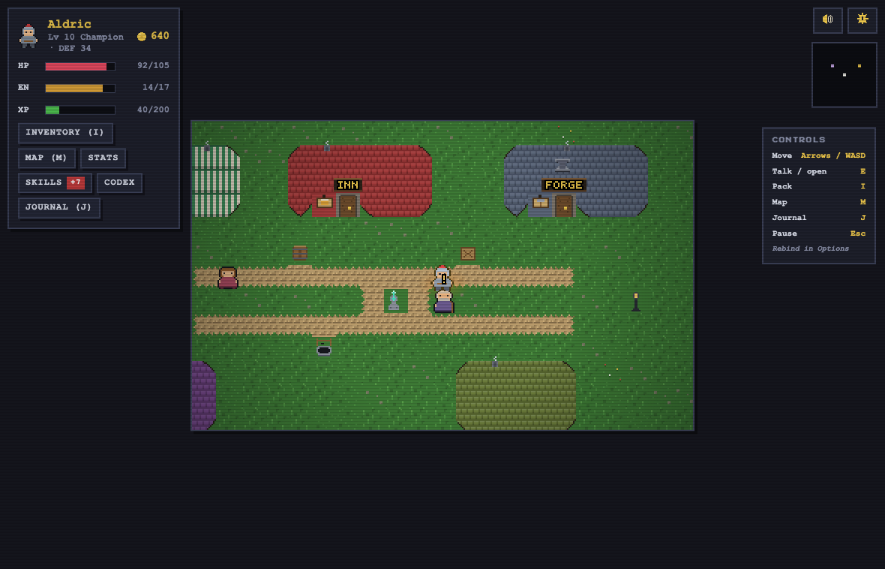

<p align="center">
  
</p>

<h1 align="center">Pixelheim</h1>

<p align="center">
  <b>A retro pixel-art open-world RPG built with React, TypeScript and PixiJS. No game engine - a pure reducer for the rules, a WebGL canvas for the world.</b><br />
  Fifteen floors. Two bosses. Infinite cheese wheels. Currently v0.46 - 1.0 has to be earned.
</p>

---

## Play it

**https://tomklotzpro.github.io/pixelheim/** - deployed to GitHub Pages on every push to `main`. Every pull request gets its own playable preview.

## The game

You wake in Pixelheim village, in an open world called **the Ashenreach**: walk the roads (safe) or the wilds (not safe), talk to villagers, forage for materials, trade on Main Street, and climb the Ashen Mountain - ten floors of increasingly rude monsters - to slay **Fafnyr the Ashen** at the summit. Behind the dragon's hoard, a stairway descends: five more floors of the **Undermountain**, down to **Morvax the Deathless**.

- **A living open world**: a WebGL-rendered 21x13 viewport with walk cycles, flowing water with foam shorelines, swaying grass, day/night, lantern glows, drifting embers - and shingled, chimneyed, rounded buildings
- **Visible monsters, chosen fights**: no random ambushes - beasts prowl their own terrain, and bumping one starts the battle
- **7 playable classes** that **ascend**: every 5 levels a rank evolution (Apprentice to Archmage) with a cinematic, an aura, a grander look - and at rank 1 a permanent **specialization fork** (14 identities) with its own signature skill
- **Monster mastery + the Codex**: kills earn permanent family bonuses, tracked beside a blood-gated bestiary
- **Quests and the journal**: promises made in dialogue, tracked on J, paid in gold and XP
- **Your town**: buy your house (free bed, weightless home storage), then the shops themselves - owned businesses pay rent on every victory
- **Skill trees with named paths**: 12 nodes per class in three visible branches, tier badges, live numbers before you commit
- **Loot with rarities** and a paper-doll inventory: nine equip slots including two rings, jewelry that grants real stats, and a live stats panel
- **Crafting at the stations**: forage the wilds, forge at Hilda's, brew at Vex's - the gate is the making, never the wearing
- **A score per place**: town, Deepwood, Mirefen, interiors, bosses - all synthesized live, with terrain-keyed ambience under it
- **Fog-of-war world map** with fast travel, a landmark-marking mini-map, and hand-placed treasure worth going off-road for
- **Auto-save + save codes**: versioned, migrated forward on load - day-one saves still work today
- **Comfort**: contextual Esc, rebindable keys (AZERTY-ready), a controls legend, reduced-motion support

| Title | The Ashenreach |
| --- | --- |
|  |  |

| Battle | Inventory |
| --- | --- |
|  |  |

## Run it

```bash
pnpm install
pnpm dev       # play at http://localhost:5173
```

```bash
pnpm build     # typecheck + production build
pnpm preview   # serve the production build
pnpm lint      # oxlint, strict, zero warnings allowed
pnpm sprites   # regenerate the PNG sprites
pnpm test:unit # vitest over the pure game modules, milliseconds
pnpm test:e2e  # Playwright suite against the production build
pnpm sim       # headless balance simulation (--check for the regression gate)
```

## How it works

React 19 + TypeScript + PixiJS v8. The rules live in a pure reducer over a Zustand store; the renderer subscribes to state and draws - it never decides anything:

```text
src/
  app/             # the shell: boot, App routing, settings, changelog, global css
  game/            # pure game data and rules (no React)
    types.ts         # every type in the game - the shared vocabulary
    hero/            # character, roles, levels, skill tree, stat sheet math
    combat/          # battle engine, damage formulas, bestiary, encounters, drops
    economy/         # items, rarity, shops, crafting recipes, professions
  world/           # the tile engine
    tiles.ts         # tile definitions and walkability
    parseMap.ts      # ASCII grid parser with startup validation
    npcs.ts          # villagers, wander loops, dialogue hooks
    maps/            # maps authored as text grids, like the sprites
  audio/           # Web Audio chiptune synth: sequencer, sfx, buses
  render/          # the PixiJS layer: terrain, actors, atmosphere, battle stage
  state/
    store.ts         # vanilla Zustand store + dispatch (sim-drivable)
    gameReducer.ts   # a router over six domain reducers (Immer drafts)
    reducers/        # meta, battle, inventory, economy, progression, world
    save.ts          # versioned localStorage persistence + migrations
  ui/              # React on top of it all
    screens/         # full-screen views: title, creation, world, battle...
    panels/          # overlays: inventory, shop, skill tree, map, options
    widgets/         # small reusable pieces: sprites, stat bars, the HUD
```

## Conventions

* **The reducer is the game.** All rules live in pure `gameReducer` domain slices; components subscribe and dispatch, renderers draw and never decide. New actions register in BOTH the domain reducer and the `gameReducer` router.
* **Saves grow, never break.** New state is additive with defaults (no version bump); renames/reshapes need a migration + `SAVE_VERSION` bump. The frozen fixtures in `e2e/helpers.ts` are never edited.
* **Everything visual is generated.** Sprites, sheets, maps and even the bitmap font come from ASCII data (`pnpm sprites`), deterministic and diff-checked in CI. No binary art is hand-edited.
* **The canvas testifies through the mirror.** New world entities add invisible mirror nodes (`data-testid` + data attributes) so Playwright can assert against the Pixi renderer.
* **Panels own their Esc.** Any new overlay wires `useEscapeClose(onClose)` so Escape peels one layer, never stacks the pause menu.
* **Style is enforced, not discussed.** `pnpm format` (Prettier) and `pnpm lint` (oxlint, deny-warnings) both gate CI.

Maps are ASCII art in source (`.` grass, `f` forest, `^` mountain, `~` water, `=` path, `#` wall, `D` door...). The parser validates every map at load and the e2e suite imports them all, so a malformed map fails CI with a precise message.

Because the reducer is pure and headless, the game can be played by a script: [`scripts/balance-sim.ts`](scripts/balance-sim.ts) runs a bot through the full game for every role and reports win rates, level curves and gold economy. Balance changes are tuned against it.

Old saves never break: saves and save codes carry a version and are replayed through an ordered list of migrations on load, and the e2e suite pins frozen fixtures of every historical save format.

### The sprites

All the pixel art in `public/sprites/` is generated by [`scripts/generate-sprites.mjs`](scripts/generate-sprites.mjs): sprites are authored as 16x16 character grids with per-sprite palettes, and the script encodes them into real PNG files with a dependency-free PNG encoder written on top of `node:zlib`. Edit a grid, run `pnpm sprites`, done. CI fails if the generated PNGs drift from the grids.

## Roadmap ideas

- [x] Shops and gold sinks beyond the inn
- [x] The Undermountain: floors 11-15 and a second boss
- [x] Random loot drops and rarities
- [x] Status effects (poison, burn, stun)
- [x] Sound effects and chiptune music
- [x] A world map instead of a list
- [x] Skill trees, stat points, crafting, specialized shops
- [x] A WebGL renderer (PixiJS): walk cycles, particles, lighting
- [x] A pause menu, rebindable controls, a stat sheet that explains itself
- [ ] Fast travel and a fog-of-war map screen
- [ ] Quests, chests, and a house to own
- [ ] More regions beyond the Ashenreach
- [ ] Crafting professions that level up
- [ ] 1.0, eventually - it has to be earned

## License

MIT
