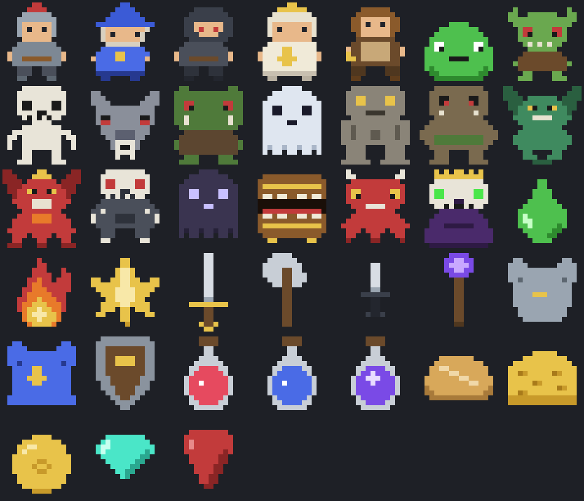
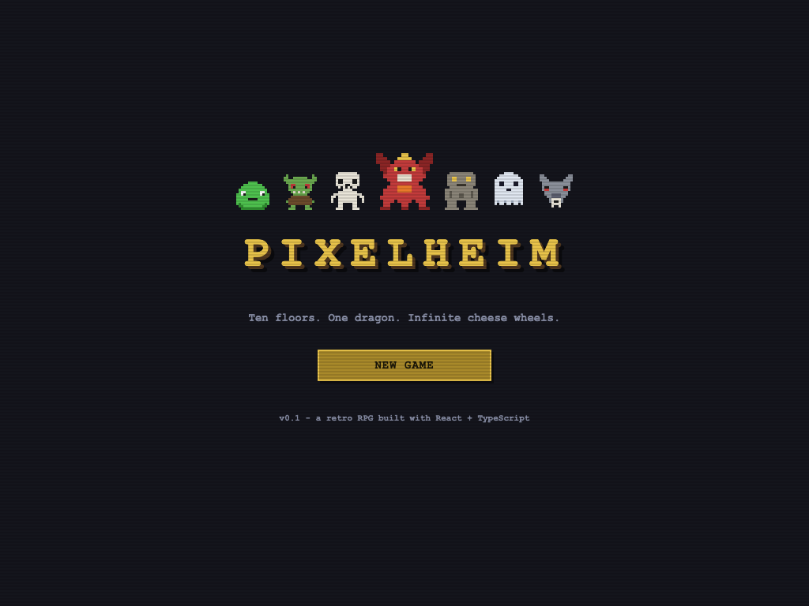
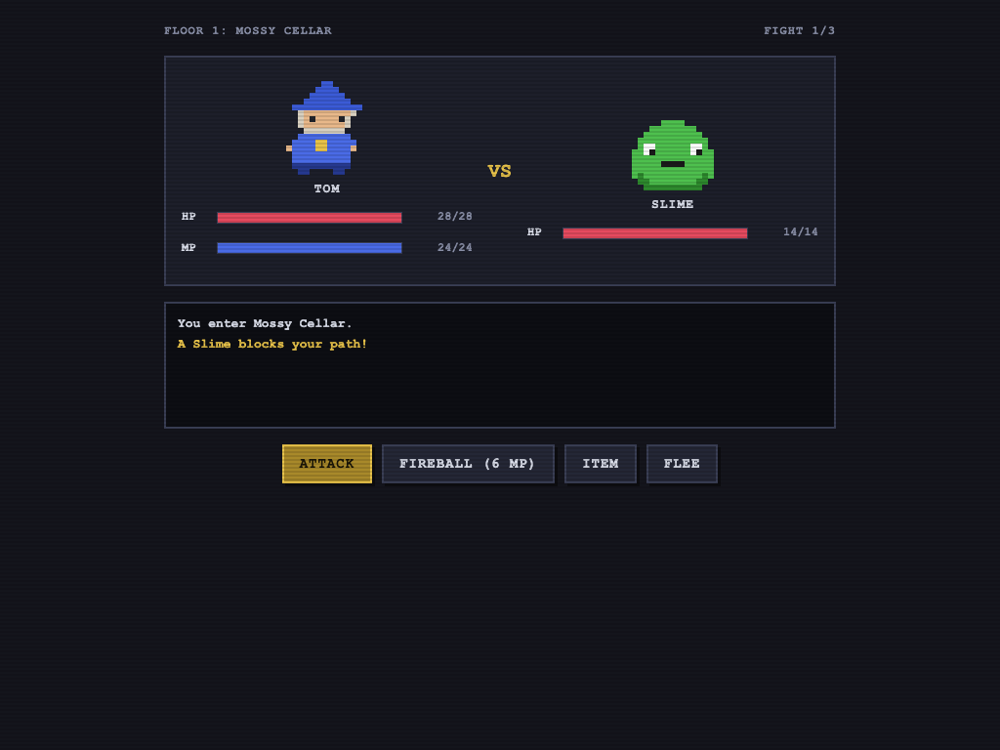
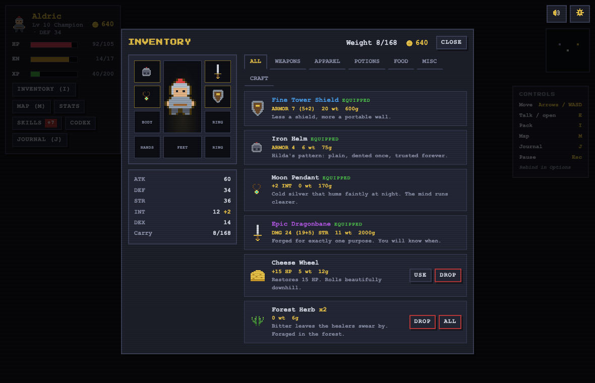

<p align="center">
  
</p>

<h1 align="center">Pixelheim</h1>

<p align="center">
  <b>A retro pixel-art RPG built with React and TypeScript. No game engine, no canvas, just components.</b><br />
  Ten floors. One dragon. Infinite cheese wheels.
</p>

---

## Play it

**https://tomklotzpro.github.io/pixelheim/** - deployed to GitHub Pages on every push to `main`.

## The game

You are an adventurer climbing the Ashen Mountain, ten floors of increasingly rude monsters, to slay **Fafnyr the Ashen** at the summit. Behind the dragon's hoard, a stairway descends: five more floors of the **Undermountain**, down to **Morvax the Deathless**.

- **4 playable roles**: Warrior, Mage, Rogue, Cleric, each with its own stats, growth, and three skills unlocked at levels 1, 3 and 6 (Berserk, Frost Nova, Poison Blade, Sanctuary...)
- **Status effects**: poison and burn tick every turn, stun steals turns; monsters inflict them and so do your skills
- **15 dungeon floors**: from the Mossy Cellar's slimes to the dragon on the Ashen Throne, then down through bone knights, shades, mimics and fire imps to the lich below; each floor is a gauntlet of fights ending with an elite
- **Turn-based combat**: attack, cast your role skill, chug a potion, or flee like a coward (dexterity helps)
- **Skyrim-style inventory**: category tabs (Weapons / Apparel / Potions / Food / Misc), equip weapon + body + off-hand, carry weight with over-encumbrance, and yes, cheese wheels
- **Progression**: XP, level ups with per-role stat growth, gold, loot rewards per floor, rest at the inn
- **Auto-save**: progress persists in localStorage, continue where you left off
- **Save codes**: copy your save as a `PXH1.…` code from the title screen and import it on any other device or browser
- **The merchant**: buy gear and potions in town (stock grows as you climb) and sell your loot at half price, which is what gems and dragon scales are for
- **Versioned saves**: saves and save codes carry a version and are migrated forward on load, so old saves keep working as the game grows

| Title | Battle | Inventory |
| --- | --- | --- |
|  |  |  |

## Run it

```bash
pnpm install
pnpm dev       # play at http://localhost:5173
```

```bash
pnpm build     # typecheck + production build
pnpm preview   # serve the production build
pnpm sprites   # regenerate the PNG sprites
pnpm test:e2e  # Playwright suite against the production build
```

## How it works

Everything is plain React + TypeScript, state lives in a single reducer:

```text
src/
  game/        # pure game data and rules (no React)
    types.ts       # every type in the game
    roles.ts       # the 4 playable roles
    items.ts       # weapons, apparel, potions, food, misc
    monsters.ts    # the bestiary
    levels.ts      # the 10 floors and their rewards
    combat.ts      # damage formulas, flee chance, elite scaling
    character.ts   # hero creation, level ups, carry weight
  state/
    gameReducer.ts # the whole game loop as a reducer
    save.ts        # localStorage persistence
  components/      # one component per screen + inventory overlay
```

### The sprites

All the pixel art in `public/sprites/` is generated by [`scripts/generate-sprites.mjs`](scripts/generate-sprites.mjs): sprites are authored as 16x16 character grids with per-sprite palettes, and the script encodes them into real PNG files with a dependency-free PNG encoder written on top of `node:zlib`. Edit a grid, run `pnpm sprites`, done.

## Roadmap ideas

- [x] Shops and gold sinks beyond the inn
- [x] The Undermountain: floors 11-15 and a second boss
- [ ] Random loot drops and rarities
- [x] More skills per role, unlocked by level
- [x] Status effects (poison, burn, stun)
- [ ] Sound effects and chiptune music
- [ ] A world map instead of a list

## License

MIT
