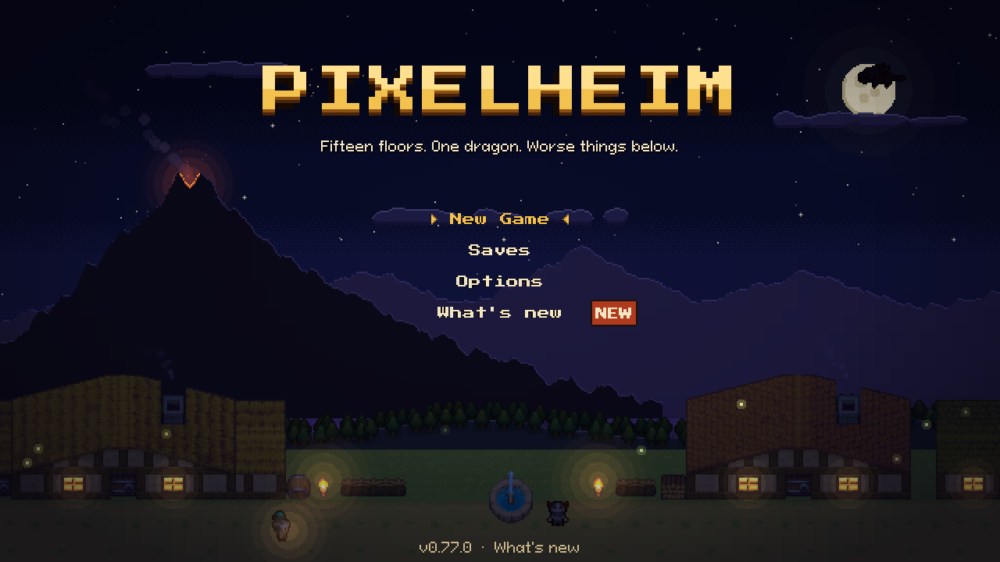
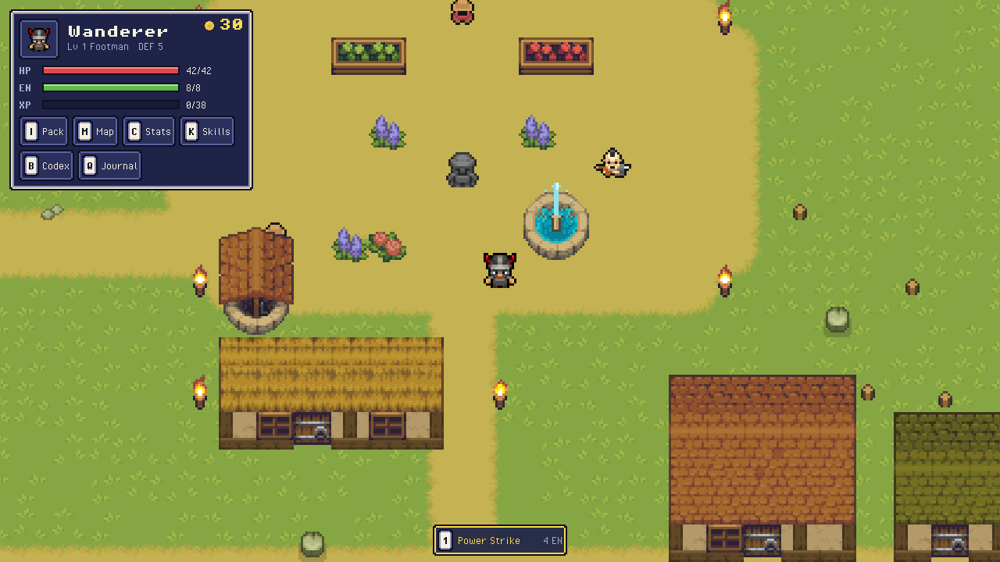
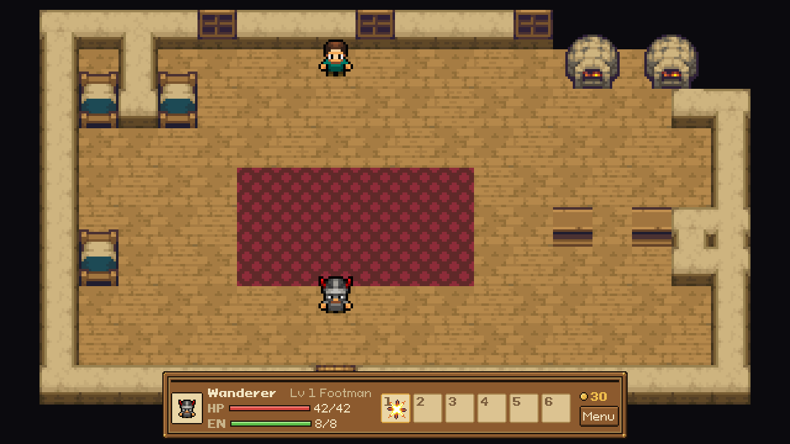
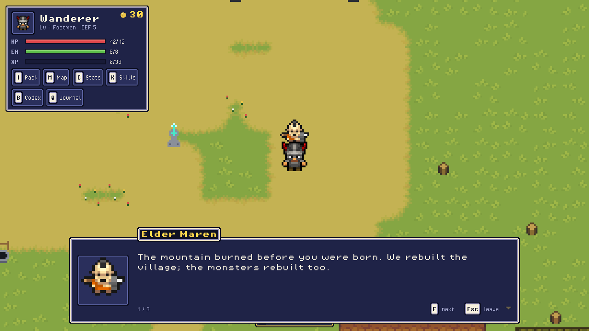
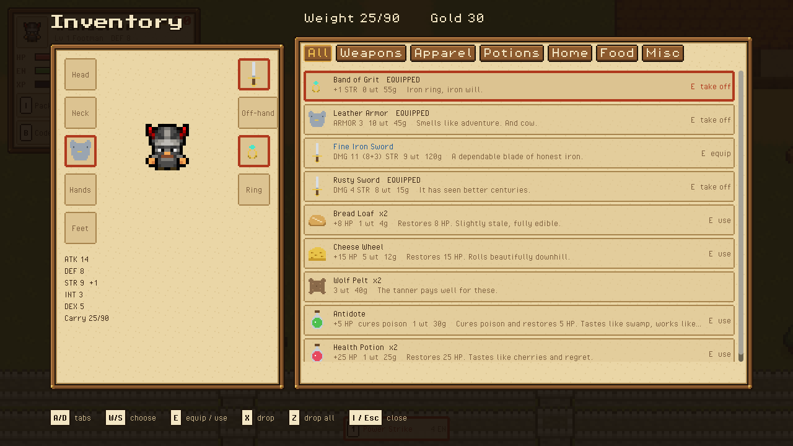

<p align="center">
  
</p>

<h1 align="center">Pixelheim</h1>

<p align="center">
  <b>A retro pixel-art open-world RPG in Godot 4.7: a village the dragon burned, the courier who stayed, the Reach's regions and the relics they keep - and the mountain last.</b><br />
  The village burned. You stayed. Currently v0.200 - 1.0 has to be earned.
</p>

---

## Play it

**https://tomklotzpro.github.io/pixelheim/** - the game, deployed to GitHub Pages on every push to `main`. It runs in the browser: keyboard, mouse or gamepad.

**On a computer** it also comes as an app for macOS and Windows, built on every push to `main` by the [Desktop app](../../actions/workflows/desktop.yml) workflow (the latest run's `pixelheim-macos` and `pixelheim-windows` artifacts). The app draws with the desktop renderer: its world is lit in high dynamic range (no banding in the night's light) and lamps and fires get a wider glow at night than the browser can afford. Its slots use the same save format as the browser's, so a save code brings a hero across either way. Neither app is signed by a store: on a Mac, open it the first time with right-click → Open; on Windows, SmartScreen's "More info" → "Run anyway".

What changed release by release: **What's new** on the title menu, or [`godot/assets/data/changelog.json`](godot/assets/data/changelog.json).

## The game

A dragon burned Pixelheim in one night, and you - the courier who came up the road with a letter for Elder Maren - stayed. Put out the fires, help the survivors rebuild, and walk out into **the Ashenreach**: the roads (safe) and the wilds (not safe), past the forest and the marsh to the Saltmere coast, the Blackiron mines, the castle of Greyhold and the Frostgate pass, each region with its people, its quests, its armour and a boss in a cave, a shaft or a cellar of its own. Fifty years ago five of the village climbed the Ashen Mountain to mend the seal that held the dragon, and only one came home. What the five left behind waits out in those regions, and only those relics open the mountain's barred gate. The mountain comes last: ten floors of increasingly rude monsters up to **Fafnyr the Ashen** on his hoard, and behind it a stair down to **Morvax the Deathless**.

- **One hand-drawn world**: hero, villagers, monsters, terrain and dungeons in Shade's Puny art; the town's timber houses, its wells, fountain, torches and fences, and the rooms behind its doors from his Medieval Age set
- **Real-time fights**: monsters prowl in packs and hunt you (the weak ones run from a hero far above them), other packs by night than by day (wolves, the dead and worse come out after dark, a little stronger and richer, while some day packs sleep by their camp fires); swing, cast your skills on the number keys, and watch the ailments land - on the same numbers the game has always used
- **7 classes that ascend**: every 5 levels a rank and its aura, and from the first rank a path that forks into 14 identities, each with a signature skill
- **Skill trees, stats and gear**: three named paths per class, stat points that explain themselves, loot with rarities on a nine-slot paper doll, and helmets and armour you can see on your hero
- **Quests and the journal**, the **codex** of every beast you have fought, and mastery bonuses for the families you hunt
- **A town that grows**: buy the house and furnish it, buy the shops and collect rent, fund the village into a city, bank and send caravans, recruit settlers from the wilds
- **Crafting** at the forge, the cauldron and your own workbench; foraging in the wilds
- **Music, stingers and weather** for every place, rendered from the game's own chiptune synth
- **Saves that never break**: three slots, autosave, save codes, and heroes from the old web edition brought over byte for byte
- **A story told in moments**: New Game opens on the village, the mountain waking and the five who climbed it fifty years ago; each boss rises with its name before you fight it, the stairway below is found, and the ending rolls credits starring every creature you fought - all skippable
- **A title to arrive at**: Pixelheim's street at night under the Ashen Mountain, lit windows and chimney smoke below, the dragon's fire smouldering in the crater above, and your hero in the street looking up at it
- **A UI like a village ledger**: one clear pixel type throughout, parchment pages in carved wooden frames, a wooden dock along the bottom with your bars, skills and gold, and screens that ease in with the sound of turning paper
- **Comfort**: rebindable keys, gamepad, options from the title, reduced motion, CRT scanlines, a fog-of-war map with fast travel

| The village                                | Inside                          |
| ------------------------------------------ | ------------------------------- |
|  |  |

| A conversation                               | The pack                               |
| -------------------------------------------- | -------------------------------------- |
|  |  |

## Run it

You need [Godot 4.7](https://godotengine.org/download) on your `PATH` (and Python 3 for the art fetch).

```bash
scripts/fetch-private-art.sh   # once: the paid art, from the private assets repo (below)
godot --path godot             # play (or open godot/ in the Godot editor)
```

```bash
godot --headless --path godot --import                        # after adding assets or scripts
godot --headless --path godot -s res://addons/gut/gut_cmdln.gd # the unit tests (GUT)
godot/tools/flows.sh                                          # the release flows, with screenshots
python3 godot/tools/synth.py                                  # re-render the generated sounds and themes
python3 godot/tools/vignettes.py <pixelheim-assets checkout>  # re-lift Shade's furnished corners for the rooms
python3 godot/tools/mapgen.py                                 # maps from their sketches in godot/maps-src/
```

**Paid art.** The town's houses, props and rooms use Shade's paid _Puny World Medieval Age_ pack, and the item, skill and ailment icons come from his paid icon packs (with his free CC0 ones). None of the paid art may be redistributed, so it lives in the private `TomKlotzPro/pixelheim-assets` repository (`retro-rpg/shade/`). `scripts/fetch-private-art.sh` installs it with your GitHub login, and the deploy fetches it with a read-only deploy key. Without it the game still runs on Shade's free art alone: the town's houses, props and paid icons are missing.

More on the Godot project - the save format, the screenshot harness, the release flows, web export - in [`godot/README.md`](godot/README.md).

## How it works

```text
godot/                 the game (Godot 4.7, GDScript)
  scripts/
    state/             the rules and the save: GameState (autoload) and pure static classes
                       - SaveCodec, Bestiary, Economy, Skills, Quests, Town... - tested with GUT
    world.gd           the play: actors, the HUD, interaction, combat, music
    map_view.gd        a map as drawn: ground, houses, rooms, dungeons, props, chests
    *_screen.gd        menus and screens, all styled by ui_style.gd
    puny_*.gd          Shade's art laid over the maps: terrain, dungeons, the town, props, rooms
  assets/              art (Shade's CC0 packs), fonts, audio, and the game's data:
    data/              items, monsters, quests, villagers, the town, the changelog (JSON)
    maps/              every map, one row of tiles per line (JSON); new ones drawn as sketches in godot/maps-src/
  test/unit/           GUT tests
  tools/               the release flows, the boot splash, the icon, the sound synth, the room vignettes
scripts/               fetch-private-art.sh, which installs the paid art
docs/                  screenshots, and godot-parity.md: the record of the port
```

- **Rules are pure.** Game rules live in static GDScript classes with no nodes, so they test fast; scenes draw, move and route input. Everything that persists changes only through `GameState`.
- **Saves keep the old web edition's format, byte for byte.** Its heroes still load, and migrations replay old saves forward.
- **The look lives in one place.** `ui_style.gd` draws every window and picks every font size; pixel fonts render at whole sizes only.
- **Verified by playing.** Besides the unit tests, `godot/tools/flows.sh` walks the release flows (spawn, doors, chests, shops, crafting, quests, rank-ups, fights, death, saves, conversations, smooth walking) through a real window and checks each one.

## History

Pixelheim began as a React + TypeScript + PixiJS game in the browser, with a pure reducer for its rules and a WebGL canvas for its world. It moved to Godot in v0.66 and the web edition was retired in v0.75: its maps, data tables and changelog now live with the game (`godot/assets/`), and its heroes still come across from the saves screen. Everything it was is in this repository's history; `docs/godot-parity.md` records how each of its features was ported.

## Roadmap ideas

- [x] Shops, crafting, a house to own, a town that grows
- [x] The Undermountain: floors 11-15 and a second boss
- [x] Skill trees, ranks and paths
- [x] Music, ambience and sound
- [x] The move to Godot, with one artist for the whole world
- [x] Worn gear drawn on the hero
- [ ] Touch controls for phones
- [ ] More regions beyond the Ashenreach
- [ ] 1.0, eventually - it has to be earned

## License

The code is MIT. The art in `godot/assets/puny/` is Shade's CC0 work (see its `LICENSE.txt`); his paid packs (Medieval Age and the icon packs) are licensed to the author and kept private. Fonts: Pixeloid (OFL) and Press Start 2P (OFL).
