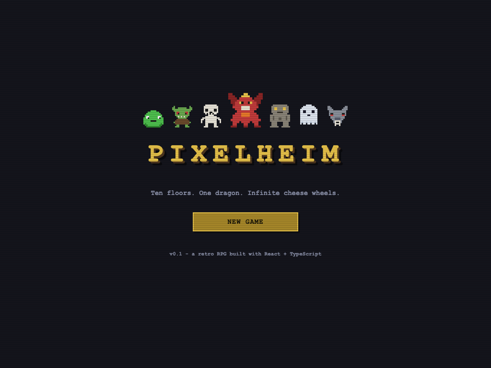
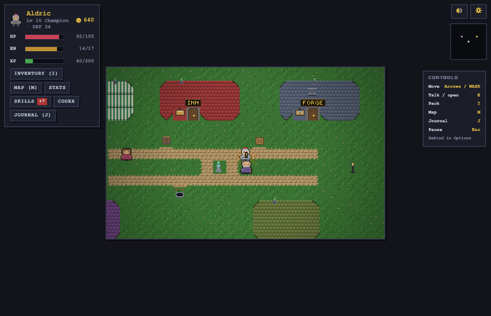

<p align="center">
  
</p>

<h1 align="center">Pixelheim</h1>

<p align="center">
  <b>A retro pixel-art open-world RPG in Godot 4.7: one hero, one village, fifteen floors of a mountain and what lies under it.</b><br />
  Fifteen floors. Two bosses. Infinite cheese wheels. Currently v0.71 - 1.0 has to be earned.
</p>

---

## Play it

**https://tomklotzpro.github.io/pixelheim/** - the game, deployed to GitHub Pages on every push to `main`. It runs in the browser: keyboard, mouse or gamepad.

**https://tomklotzpro.github.io/pixelheim/classic/** - the classic edition, the React/PixiJS game Pixelheim started as, kept playable and frozen (see [The classic edition](#the-classic-edition)). Both share one site, so a classic hero moves into the game from its saves screen.

What changed release by release: the **What's new** link under the title menu, or [`src/app/changelog.ts`](src/app/changelog.ts).

## The game

You wake in Pixelheim village, in an open world called **the Ashenreach**: walk the roads (safe) or the wilds (not safe), talk to villagers, forage, trade, and climb the Ashen Mountain - ten floors of increasingly rude monsters - to slay **Fafnyr the Ashen** at the summit. Behind the dragon's hoard a stairway descends: five more floors of the **Undermountain**, down to **Morvax the Deathless**.

- **One hand-drawn world**: hero, villagers, monsters, terrain and dungeons in Shade's Puny art; the town's timber houses and the rooms behind their doors from his Medieval Age set
- **Real-time fights**: monsters prowl in packs and hunt you; swing, cast your skills on the number keys, and watch the ailments land - on the same numbers the game has always used
- **7 classes that ascend**: every 5 levels a rank and its aura, and from the first rank a path that forks into 14 identities, each with a signature skill
- **Skill trees, stats and gear**: three named paths per class, stat points that explain themselves, loot with rarities on a nine-slot paper doll
- **Quests and the journal**, the **codex** of every beast you have fought, and mastery bonuses for the families you hunt
- **A town that grows**: buy the house and furnish it, buy the shops and collect rent, fund the village into a city, bank and send caravans, recruit settlers from the wilds
- **Crafting** at the forge, the cauldron and your own workbench; foraging in the wilds
- **Music, stingers and weather** for every place, rendered from the game's own chiptune synth
- **Saves that never break**: three slots, autosave, save codes, and heroes brought over from the classic edition byte for byte
- **Comfort**: rebindable keys, gamepad, options from the title, reduced motion, CRT scanlines, a fog-of-war map with fast travel

| The village                                | Inside                          |
| ------------------------------------------ | ------------------------------- |
|  |  |

| A conversation                               | The pack                               |
| -------------------------------------------- | -------------------------------------- |
|  |  |

## Run it

You need [Godot 4.7](https://godotengine.org/download) on your `PATH` and [pnpm](https://pnpm.io).

```bash
pnpm install
pnpm godot:art                 # once: the paid art, from the private assets repo (below)
godot --path godot             # play (or open godot/ in the Godot editor)
```

```bash
godot --headless --path godot --import                        # after adding assets or scripts
godot --headless --path godot -s res://addons/gut/gut_cmdln.gd # the unit tests (GUT)
godot/tools/flows.sh                                          # the release flows, with screenshots
pnpm godot:sync                                               # re-export maps and data from src/
```

**Paid art.** The town's houses and rooms use Shade's paid _Puny World Medieval Age_ pack, which may not be redistributed, so it lives in the private `TomKlotzPro/pixelheim-assets` repository. `pnpm godot:art` installs it with your GitHub login, and the deploy fetches it with a read-only deploy key. Without it the game still runs, with plainer buildings.

More on the Godot project - the save format, the screenshot harness, the release flows, web export - in [`godot/README.md`](godot/README.md).

## How it works

```text
godot/                 the game (Godot 4.7, GDScript)
  scripts/
    state/             the rules and the save: GameState (autoload) and pure static classes
                       - SaveCodec, Bestiary, Economy, Skills, Quests, Town... - tested with GUT
    world.gd           the world: maps, actors, the HUD, interaction
    *_screen.gd        menus and screens, all styled by ui_style.gd
    puny_*.gd          Shade's art laid over the maps: terrain, dungeons, the town, rooms
  assets/              art (CC0 Puny packs), fonts, audio, and data exported from src/
  test/unit/           GUT tests
  tools/flows.sh       the release flows through the screenshot harness
src/                   the classic edition (React + TypeScript + PixiJS); its maps and
                       data tables still feed the game through scripts/export-maps.ts
scripts/               the exporters, the audio renderer, the sprite generator
docs/                  godot-parity.md (where every classic feature stands) and screenshots
```

- **Rules are pure.** Game rules live in static GDScript classes with no nodes, so they test fast; scenes draw, move and route input. Everything that persists changes only through `GameState`.
- **Saves are the classic edition's format, byte for byte.** A save from either edition loads in the other; migrations replay old saves forward.
- **The look lives in one place.** `ui_style.gd` draws every window and picks every font size; pixel fonts render at whole sizes only.
- **Verified by playing.** Besides the unit tests, `godot/tools/flows.sh` walks the release flows (spawn, doors, chests, shops, crafting, quests, rank-ups, fights, death, saves, conversations, smooth walking) through a real window and checks each one.

## The classic edition

Pixelheim began as a React 19 + TypeScript + PixiJS game with a pure reducer for its rules and a WebGL canvas for its world. It is still playable at [/classic/](https://tomklotzpro.github.io/pixelheim/classic/) and still in this repository (`src/`), but it is **frozen**: bug fixes only. The Godot game owns the rules from now on; the classic edition's maps and data tables still feed it through `pnpm godot:sync`.

```bash
pnpm dev        # the classic edition at http://localhost:5173
pnpm test:unit  # its unit tests
pnpm test:e2e   # its Playwright suite
```

| Classic title                           | Classic world                    |
| --------------------------------------- | -------------------------------- |
|  |  |

## Roadmap ideas

- [x] Shops, crafting, a house to own, a town that grows
- [x] The Undermountain: floors 11-15 and a second boss
- [x] Skill trees, ranks and paths
- [x] Music, ambience and sound
- [x] The move to Godot, with one artist for the whole world
- [ ] Worn gear drawn on the hero
- [ ] Touch controls for phones
- [ ] More regions beyond the Ashenreach
- [ ] 1.0, eventually - it has to be earned

## License

The code is MIT. The art in `godot/assets/puny/` is Shade's CC0 work (see its `LICENSE.txt`); the Medieval Age pack is licensed to the author and kept private. Fonts: Pixel Operator (CC0) and Press Start 2P (OFL).
